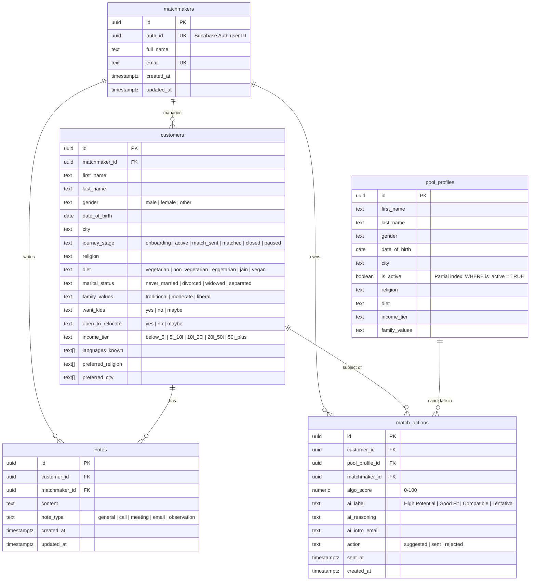

<p align="center">
  
  
  
  
  
  
  
</p>

# The Date Crew — Matchmaker Dashboard

> **An AI-powered, premium matchmaking operations dashboard** built for elite Indian matrimonial services. Matchmakers manage their client pipeline, run algorithmic + AI compatibility scoring against a pool of 200+ candidate profiles, and generate personalized introduction emails — all from a single, beautifully animated interface.

---

## Table of Contents

- [Overview](#overview)
- [Architecture](#architecture)
- [Technology Stack](#technology-stack)
- [Project Structure](#project-structure)
- [Database Schema](#database-schema)
- [Backend API Reference](#backend-api-reference)
- [Matching Algorithm](#matching-algorithm)
- [AI Integration](#ai-integration)
- [Frontend Architecture](#frontend-architecture)
- [Authentication Flow](#authentication-flow)
- [Getting Started](#getting-started)
- [Environment Variables](#environment-variables)
- [Database Setup & Seeding](#database-setup--seeding)
- [Running Locally](#running-locally)
- [Testing](#testing)
- [Docker](#docker)
- [CI/CD Pipeline](#cicd-pipeline)
- [Deployment](#deployment)
- [License](#license)

---

## Overview

The Date Crew (TDC) Matchmaker Dashboard is a full-stack monorepo application designed for professional matchmakers operating in the Indian matrimonial space. The system enables matchmakers to:

- **Manage client profiles** through a structured pipeline (`onboarding → active → match_sent → matched → closed → paused`)
- **Run AI-augmented matching** against a pool of 200+ seeded candidate profiles using a multi-criteria scoring algorithm
- **Generate personalized outreach emails** using Google Gemini AI for each recommended match
- **Track match lifecycle** — suggest, send, or reject matches with full audit trails
- **Maintain client notes** — log calls, meetings, emails, and observations per client
- **View real-time analytics** — pipeline progress, success rates, and activity summaries

---

## Architecture

```
┌─────────────────────────────────────────────────────────────┐
│                      BROWSER CLIENT                         │
│  Next.js 16 (App Router) · Tailwind v4 · GSAP · Zustand    │
│  React Query · Framer Motion · Supabase SSR Auth            │
└──────────────────────────┬──────────────────────────────────┘
                           │ HTTPS (Axios)
                           │ Bearer JWT in Authorization header
                           ▼
┌──────────────────────────────────────────────────────────────┐
│                     EXPRESS API SERVER                        │
│  Routes → Middleware → Controllers → Services                │
│  ┌──────────┐  ┌──────────┐  ┌──────────────┐               │
│  │ Auth MW   │  │ Validate │  │ Rate Limiter │               │
│  │(Supabase) │  │  (Zod)   │  │ (10 req/min) │               │
│  └──────────┘  └──────────┘  └──────────────┘               │
│  ┌──────────────────────────────────────────┐                │
│  │         Matching Engine Service          │                │
│  │  Deterministic Scoring + AI Enrichment   │                │
│  └──────────────────────────────────────────┘                │
│  ┌──────────────────────────────────────────┐                │
│  │            Gemini AI Service             │                │
│  │  Compatibility Labels · Intro Emails     │                │
│  └──────────────────────────────────────────┘                │
└──────────────────────────┬───────────────────────────────────┘
                           │ Drizzle ORM (postgres.js driver)
                           ▼
┌──────────────────────────────────────────────────────────────┐
│                    POSTGRESQL (Supabase)                      │
│  matchmakers · customers · pool_profiles                     │
│  notes · match_actions                                       │
│  Row-Level Security (RLS) Policies                           │
└──────────────────────────────────────────────────────────────┘
```

### Data Flow

1. **Login**: Frontend sends credentials to `POST /api/v1/auth/login` → Express authenticates via Supabase Auth → returns JWT + matchmaker profile → frontend sets Supabase browser session + Zustand store
2. **Dashboard Load**: Frontend queries `GET /customers` and `GET /customers/stats` via React Query → backend resolves matchmaker from JWT → scoped DB queries with `matchmakerId` filter
3. **Run Matches**: `POST /customers/:id/matches/run` → scoring engine fetches eligible pool profiles → scores via `scoreMaleClientMatches()` / `scoreFemaleClientMatches()` → top 10 enriched with Gemini AI reasoning → upserted into `match_actions` table
4. **Send Match**: `POST /matches/:matchActionId/send` → updates action to `'sent'` with timestamp → logs mock email dispatch
5. **Generate Email**: `POST /ai/intro-email` → Gemini generates personalized intro email → stored in `match_actions.ai_intro_email`

---

## Technology Stack

### Workspace & Tooling
| Tool | Version | Purpose |
|:-----|:--------|:--------|
| pnpm | 9+ | Monorepo workspace manager |
| TypeScript | 5.4 | Strict typing across all packages |
| Docker | Multi-stage | Containerized backend deployment |
| GitHub Actions | CI + CD | Automated typecheck, lint, build, and deploy |

### Frontend (`app/frontend`)
| Library | Version | Purpose |
|:--------|:--------|:--------|
| Next.js | 16.2.7 | App Router, SSR middleware, route protection |
| React | 19.2.4 | UI rendering |
| Tailwind CSS | v4 | Utility-first styling with custom design tokens |
| Zustand | 5.x | Lightweight global auth state |
| TanStack React Query | 5.x | Server state caching, pagination, refetch |
| GSAP + @gsap/react | 3.15 | Preloader curtain animation, login form reveal |
| Framer Motion | 12.x | Dashboard stagger animations, micro-interactions |
| Axios | 1.17 | HTTP client with auth interceptors |
| Supabase SSR | 0.10 | Server-side cookie auth, middleware route guard |
| Lucide React | 1.17 | Icon library |
| SplitType | 0.3 | Text splitting for typography animations |

### Backend (`app/backend`)
| Library | Version | Purpose |
|:--------|:--------|:--------|
| Express | 4.19 | HTTP server, REST API routing |
| Drizzle ORM | 0.30 | Type-safe SQL queries, schema definitions |
| postgres.js | 3.4 | PostgreSQL driver (connection pooling) |
| Supabase JS | 2.43 | Server-side auth token validation |
| Google Generative AI | 0.11 | Gemini model access for scoring + emails |
| Zod | 3.23 | Request body/param validation schemas |
| Winston | 3.13 | Structured JSON logging with colorized console |
| express-rate-limit | 8.5 | Per-matchmaker AI endpoint throttling |
| Jest + Supertest | 29.x | Unit and integration testing |

### Database (`db`)
| Component | Details |
|:----------|:--------|
| PostgreSQL | Hosted on Supabase (pooler on port 6543, direct on 5432) |
| Drizzle Kit | 0.21 — migration generation, schema push |
| Faker.js | 10.x — pool profile seeding (200 profiles) |

---

## Project Structure

```
tdc/
├── .github/workflows/
│   ├── ci.yml                    # CI: typecheck + lint on push/PR
│   └── deploy.yml                # CD: test → Docker build → GHCR push → Render deploy hook
│
├── app/
│   ├── backend/
│   │   ├── Dockerfile            # Multi-stage Node 22 Alpine build
│   │   ├── src/
│   │   │   ├── index.ts          # Express app entry, CORS, health checks
│   │   │   ├── routes/
│   │   │   │   ├── index.ts      # Route aggregator
│   │   │   │   ├── auth.routes.ts
│   │   │   │   ├── customers.routes.ts
│   │   │   │   ├── notes.routes.ts
│   │   │   │   ├── matches.routes.ts
│   │   │   │   ├── ai.routes.ts
│   │   │   │   └── pool.routes.ts
│   │   │   ├── controllers/
│   │   │   │   ├── auth.controller.ts
│   │   │   │   ├── customers.controller.ts
│   │   │   │   ├── notes.controller.ts
│   │   │   │   ├── matches.controller.ts
│   │   │   │   └── ai.controller.ts
│   │   │   ├── services/
│   │   │   │   ├── auth.service.ts        # Supabase client (stateless, no session persist)
│   │   │   │   ├── matching.service.ts    # Scoring algorithm + match orchestration
│   │   │   │   └── ai.service.ts          # Gemini API wrappers
│   │   │   ├── middleware/
│   │   │   │   ├── auth.middleware.ts      # JWT → Supabase → matchmaker resolution
│   │   │   │   ├── validate.middleware.ts  # Zod schema validation
│   │   │   │   ├── rate-limit.middleware.ts # 10 req/min per matchmaker
│   │   │   │   └── error.middleware.ts     # Global error handler
│   │   │   ├── utils/
│   │   │   │   ├── logger.ts              # Winston structured logger
│   │   │   │   └── cache.ts              # In-memory auth profile cache (5min TTL)
│   │   │   └── tests/
│   │   │       ├── unit/
│   │   │       │   ├── scoring.test.ts
│   │   │       │   ├── ai.service.test.ts
│   │   │       │   └── auth.middleware.test.ts
│   │   │       └── integration/
│   │   │           ├── customer.test.ts
│   │   │           ├── matching.test.ts
│   │   │           └── ai.test.ts
│   │   ├── jest.config.js
│   │   ├── tsconfig.json
│   │   └── package.json
│   │
│   └── frontend/
│       ├── src/
│       │   ├── app/
│       │   │   ├── layout.tsx            # Root layout: Geist + Absans fonts, Providers
│       │   │   ├── page.tsx              # Landing page (Hero)
│       │   │   ├── providers.tsx         # QueryClient + SessionHydrator + Preloader
│       │   │   ├── globals.css           # Tailwind v4 theme tokens, design system
│       │   │   ├── login/page.tsx        # GSAP-animated glassmorphism login
│       │   │   ├── dashboard/page.tsx    # Main dashboard: stats, widgets, customer table
│       │   │   └── customer/[id]/page.tsx # Customer detail: biodata, notes, matches
│       │   ├── components/
│       │   │   ├── Hero.tsx              # Landing hero section
│       │   │   ├── preloader.tsx         # GSAP 3-panel curtain preloader
│       │   │   ├── layout/AppShell.tsx   # Sidebar navigation + top bar
│       │   │   ├── customers/
│       │   │   │   ├── CustomerTable.tsx  # Filterable, paginated data table
│       │   │   │   └── JourneyTracker.tsx # Pipeline stage stepper
│       │   │   ├── matches/
│       │   │   │   ├── MatchCard.tsx      # Candidate score card with AI labels
│       │   │   │   └── SendMatchModal.tsx # Email preview + send confirmation
│       │   │   └── profile/
│       │   │       └── BiodataPanel.tsx   # Sliding biodata detail sheet
│       │   ├── lib/
│       │   │   ├── api.ts                # Axios instance + auth interceptors
│       │   │   └── supabase.ts           # Supabase browser client
│       │   ├── store/
│       │   │   └── authStore.ts          # Zustand auth state (token + matchmaker)
│       │   └── proxy.ts                  # Next.js middleware: route guards + redirects
│       ├── next.config.ts                # Root .env loader, env injection
│       ├── postcss.config.mjs
│       └── package.json
│
├── db/
│   ├── index.ts                   # Drizzle client (singleton, postgres.js driver)
│   ├── drizzle.config.ts          # Drizzle Kit config
│   ├── migrate.ts                 # Programmatic migration runner (dynamic path resolution)
│   ├── schema/
│   │   ├── index.ts               # Barrel export
│   │   ├── matchmakers.ts
│   │   ├── customers.ts
│   │   ├── pool_profiles.ts
│   │   ├── notes.ts
│   │   └── match_actions.ts
│   ├── seeds/
│   │   ├── matchmakers.seed.ts    # Seeds default matchmaker (Priya Sharma)
│   │   ├── pool_profiles.seed.ts  # Seeds 200 faker profiles (100M + 100F)
│   │   └── apply_rls.ts           # Row-Level Security policy application
│   ├── migrations/                # Generated SQL migration files
│   └── package.json
│
├── docker-compose.yml             # Backend service with env passthrough
├── docker-compose.override.yml    # Dev override: tsx watch mode
├── package.json                   # Root monorepo scripts
├── pnpm-workspace.yaml            # Workspace: app/*, db
├── .env.example                   # Environment variable template
└── .gitignore
```

---

## Database Schema

The database consists of 5 tables with full referential integrity, composite indexes, and `CHECK` constraints for enum-like columns.

### Entity Relationship Diagram



### Key Indexes

| Table | Index | Columns |
|:------|:------|:--------|
| `customers` | `idx_customers_matchmaker_id` | `matchmaker_id` |
| `customers` | `idx_customers_matchmaker_gender` | `matchmaker_id, gender` |
| `customers` | `idx_customers_matchmaker_stage` | `matchmaker_id, journey_stage` |
| `pool_profiles` | `idx_pool_gender_active` | `gender WHERE is_active = TRUE` |
| `match_actions` | `idx_match_actions_customer_action` | `customer_id, action` |
| `match_actions` | `match_actions_customer_id_pool_profile_id_unique` | `customer_id, pool_profile_id` (UNIQUE) |

### Row-Level Security (RLS)

RLS policies are defined in `db/seeds/apply_rls.ts` and enforce that authenticated Supabase users can only CRUD rows where `matchmaker_id` maps to their `auth.uid()`. Policies cover all operations (SELECT, INSERT, UPDATE, DELETE) on `customers`, `notes`, and `match_actions`.

---

## Backend API Reference

All routes are prefixed with `/api/v1`. Protected routes require a `Bearer <token>` header. Responses follow a consistent envelope:

```json
{ "data": { ... } }               // Success
{ "error": { "code": "...", "message": "..." } }  // Error
```

### Authentication

| Method | Path | Auth | Description |
|:-------|:-----|:-----|:------------|
| `POST` | `/auth/login` | ✗ | Email/password login → returns `accessToken`, `refreshToken`, `matchmaker` profile |
| `POST` | `/auth/logout` | ✓ | Invalidates server-side session (client discards tokens) |
| `GET` | `/auth/me` | ✓ | Returns current matchmaker profile from DB |

### Customers

| Method | Path | Auth | Description |
|:-------|:-----|:-----|:------------|
| `GET` | `/customers` | ✓ | Paginated list (filters: `search`, `gender`, `stage`, `city`, `page`, `perPage`) |
| `GET` | `/customers/stats` | ✓ | Aggregate journey stage counts for dashboard metrics |
| `GET` | `/customers/:id` | ✓ | Full customer profile with computed `age` |
| `POST` | `/customers` | ✓ | Create customer (Zod-validated, 40+ fields) |
| `PUT` | `/customers/:id` | ✓ | Update customer (partial body) |
| `PATCH` | `/customers/:id/stage` | ✓ | Update `journeyStage` field only |

### Notes

| Method | Path | Auth | Description |
|:-------|:-----|:-----|:------------|
| `GET` | `/customers/:id/notes` | ✓ | List notes for a customer (desc by `created_at`) |
| `POST` | `/customers/:id/notes` | ✓ | Create note (`content`, `noteType`) |
| `PUT` | `/notes/:noteId` | ✓ | Update note content/type (ownership verified via join) |
| `DELETE` | `/notes/:noteId` | ✓ | Delete note (ownership verified via join) |

### Matching

| Method | Path | Auth | Rate Limit | Description |
|:-------|:-----|:-----|:-----------|:------------|
| `POST` | `/customers/:id/matches/run` | ✓ | 10/min | Run scoring algorithm → top 10 suggestions |
| `POST` | `/matches/:matchActionId/send` | ✓ | — | Mark match as `'sent'` + timestamp |
| `POST` | `/matches/:matchActionId/reject` | ✓ | — | Mark match as `'rejected'` |

### AI

| Method | Path | Auth | Rate Limit | Description |
|:-------|:-----|:-----|:-----------|:------------|
| `POST` | `/ai/intro-email` | ✓ | 10/min | Generate personalized introduction email via Gemini |

### Health Checks

| Method | Path | Description |
|:-------|:-----|:------------|
| `GET` | `/health` or `/healthz` | Returns `{ "status": "OK", "timestamp": "..." }` |

---

## Matching Algorithm

The matching engine (`app/backend/src/services/matching.service.ts`) implements a **gender-aware, deterministic scoring system** with AI enrichment.

### Pipeline

```
1. Fetch client profile
2. Determine opposite gender for candidate pool
3. Exclude previously sent/rejected candidates
4. Fetch all active pool profiles of opposite gender
5. Score each candidate (gender-specific criteria, 100 pts max)
6. Sort descending → take top 10
7. Enrich each with Gemini AI compatibility reasoning
8. Upsert into match_actions (ON CONFLICT UPDATE)
```

### Scoring: Male Client ↔ Female Candidate (100 pts)

| # | Criterion | Points | Logic |
|:--|:----------|:-------|:------|
| 1 | Age Profile | 20 | Candidate 1–5 years younger → 20pts; >5 years → 10pts |
| 2 | Income | 15 | Candidate income < client income → 15pts |
| 3 | Height | 10 | Candidate shorter than client → 10pts |
| 4 | Kids Preference | 20 | Exact match on `wantKids` → 20pts |
| 5 | Religion | 15 | Case-insensitive match → 15pts |
| 6 | Marital Status | 10 | Both `never_married` → 10pts |
| 7 | City/Relocation | 10 | Same city OR candidate open to relocate → 10pts |

### Scoring: Female Client ↔ Male Candidate (100 pts)

| # | Criterion | Points | Logic |
|:--|:----------|:-------|:------|
| 1 | Profession Tier | 20 | Candidate income tier ≥ client tier → 20pts |
| 2 | Values Alignment | 20 | Exact match on `familyValues` → 20pts |
| 3 | Relocation Match | 15 | Same `openToRelocate` value → 15pts |
| 4 | Religion | 15 | Case-insensitive match → 15pts |
| 5 | Age Proximity | 15 | Absolute age diff ≤ 3 years → 15pts |
| 6 | Diet Match | 10 | Case-insensitive match → 10pts |
| 7 | Language Overlap | 5 | Any shared language → 5pts |

### AI Label Thresholds

| Score Range | Label |
|:------------|:------|
| > 70 | **High Potential** |
| = 70 | **Good Fit** |
| 65–69 | **Compatible** |
| < 65 | **Tentative** |

### Fallback Behavior

If Gemini API fails, the system generates deterministic fallback reasoning by evaluating shared city, religion, and diet matches.

---

## AI Integration

The application integrates Google Gemini (`gemini-3.1-flash-lite`) for two capabilities:

### 1. Compatibility Scoring

**Used during**: `POST /customers/:id/matches/run`

The AI receives both profiles as JSON and returns:
```json
{
  "label": "High Potential",
  "reasoning": "Both share traditional Hindu values, reside in Mumbai, and have aligned career trajectories."
}
```

The `label` from AI is **not used** — the final label is determined strictly by the algorithmic score thresholds. Only the `reasoning` text is persisted to `match_actions.ai_reasoning`.

### 2. Introduction Email Generation

**Used during**: `POST /api/v1/ai/intro-email`

The AI generates a personalized email with `subject` and `body` fields, written in a warm, premium tone suited for Indian matrimonial context. The generated email is persisted to `match_actions.ai_intro_email`.

**Fallback**: If Gemini fails, a template-based email is generated using profile details (name, age, city, designation, company).

### Rate Limiting

All AI endpoints are protected by `express-rate-limit`:
- **Window**: 1 minute
- **Max requests**: 10 per authenticated matchmaker
- **Key**: `matchmakerId` (falls back to IP)

---

## Frontend Architecture

### Design System

The frontend uses a **custom Tailwind v4 theme** with semantic design tokens defined in `globals.css`:

| Token | Value | Usage |
|:------|:------|:------|
| `--color-primary-bg` | `#F2EEFA` | App background (soft lavender) |
| `--color-secondary-surface` | `#FFFFFF` | Cards, panels |
| `--color-soft-purple` | `#B99AF5` | Primary accent |
| `--color-soft-green` | `#6CBF8D` | Success states |
| `--color-soft-blue` | `#7DA8FF` | Info/link accents |
| `--color-warm-yellow` | `#E8C75F` | Highlight/star indicators |
| `--color-text-primary` | `#1A1A1A` | Headings |
| `--color-text-secondary` | `#6B6B6B` | Body text |
| `--color-text-muted` | `#9A9A9A` | Labels, captions |

**Typography**: Geist Sans (body), Geist Mono (code), Absans (display/headings — custom local font).

### Page Routes

| Route | Component | Description |
|:------|:----------|:------------|
| `/` | `Hero.tsx` | Public landing page |
| `/login` | `login/page.tsx` | Glassmorphism login with GSAP animations |
| `/dashboard` | `dashboard/page.tsx` | Main workspace: stats grid, pipeline widgets, customer table |
| `/customer/[id]` | `customer/[id]/page.tsx` | Client detail: biodata panel, notes, match cards |

### Key Components

| Component | Purpose |
|:----------|:--------|
| `Preloader` | 3-panel GSAP curtain animation on app load and logout transitions |
| `AppShell` | Persistent sidebar navigation with matchmaker profile display |
| `CustomerTable` | Filterable, paginated table with search, gender, stage, city filters |
| `JourneyTracker` | Visual pipeline stepper showing client progression stages |
| `BiodataPanel` | Sliding sheet displaying full client biodata across 8+ sections |
| `MatchCard` | Candidate card showing score, AI label, reasoning, send/reject actions |
| `SendMatchModal` | AI-generated email preview with send confirmation dialog |

### State Management

| Layer | Tool | Purpose |
|:------|:-----|:--------|
| Global Auth | Zustand (`authStore`) | `accessToken`, `matchmaker` profile, `isLoggingOut` flag |
| Server State | React Query | Customers list, stats, customer details, notes, matches |
| API Client | Axios interceptors | Auto-injects Bearer token; redirects to `/login` on 401 |

---

## Authentication Flow

```
┌──────────┐     POST /auth/login      ┌────────────┐    signInWithPassword    ┌──────────┐
│ Frontend │ ───────────────────────▶   │  Express   │ ──────────────────────▶  │ Supabase │
│  Login   │                            │  Backend   │                          │   Auth   │
│  Page    │ ◀─── JWT + matchmaker ──── │            │ ◀── session + user ───── │          │
└────┬─────┘                            └────────────┘                          └──────────┘
     │
     │  1. supabase.auth.setSession({ access_token, refresh_token })
     │  2. useAuthStore.setAuth(token, matchmaker)
     │  3. router.push('/dashboard')
     │
     ▼
┌──────────────────────────────────────────────────────────────────────┐
│  Next.js Middleware (proxy.ts)                                       │
│  • supabase.auth.getUser() validates session cookie                  │
│  • Protected paths: /dashboard/*, /customer/*                        │
│  • Unauthenticated → redirect to /login                              │
│  • Authenticated + /login → redirect to /dashboard                   │
└──────────────────────────────────────────────────────────────────────┘
```

### Session Hydration

The `SessionHydrator` component in `providers.tsx`:
1. Listens to `supabase.auth.onAuthStateChange`
2. On valid session, calls `GET /auth/me` to fetch the DB matchmaker profile
3. Falls back to Supabase user metadata if the backend is unreachable
4. Sets `hydrated = true` to dismiss the preloader

### Logout Flow

1. `isLoggingOut` flag triggers preloader re-mount (intro animation plays)
2. After 1.2s delay, `logoutReady = true` triggers exit animation
3. Supabase session cleared, Zustand store cleared
4. User sees preloader curtain → login page revealed underneath

---

## Getting Started

### Prerequisites

| Requirement | Version | Notes |
|:------------|:--------|:------|
| Node.js | 20+ | LTS recommended |
| pnpm | 9+ | Install: `npm install -g pnpm` |
| Supabase Project | — | Free tier works. Need URL, Anon Key, Service Role Key |
| Google Gemini API Key | — | For AI features. Matching works with fallback if missing |
| Docker Desktop | — | Optional, for containerized backend |

### Quick Start

```bash
# 1. Clone the repository
git clone https://github.com/Ronitdoes/the-date-crew.git
cd the-date-crew

# 2. Install all workspace dependencies
pnpm install

# 3. Configure environment
cp .env.example .env
# Fill in your Supabase credentials, Gemini API key, etc.

# 4. Setup database
pnpm --filter db db:push          # Push schema to Supabase

# 5. Seed data
pnpm --filter db tsx db/seeds/matchmakers.seed.ts
pnpm --filter db tsx db/seeds/pool_profiles.seed.ts

# 6. Start development servers
pnpm dev:backend    # Express on http://localhost:3001
pnpm dev:frontend   # Next.js on http://localhost:3000
```

---

## Environment Variables

Create a `.env` file at the project root. All workspace packages resolve this file via relative path imports.

```env
# ─── Database Connection ───────────────────────────────
DATABASE_URL="postgres://postgres:<password>@db.<project>.supabase.co:6543/postgres?pgbouncer=true"
DIRECT_DATABASE_URL="postgres://postgres:<password>@db.<project>.supabase.co:5432/postgres"

# ─── Supabase Auth & Config ───────────────────────────
SUPABASE_URL="https://<project>.supabase.co"
SUPABASE_ANON_KEY="your-supabase-anon-key"
SUPABASE_SERVICE_ROLE_KEY="your-supabase-service-role-key"

# ─── AI Integration ───────────────────────────────────
GEMINI_API_KEY="your-gemini-api-key"

# ─── Node Configuration ───────────────────────────────
PORT=3001
NODE_ENV=development
ALLOWED_ORIGINS=http://localhost:3000

# ─── Frontend Configuration ───────────────────────────
NEXT_PUBLIC_API_URL="http://localhost:3001/api/v1"
NEXT_PUBLIC_SUPABASE_URL="https://<project>.supabase.co"
NEXT_PUBLIC_SUPABASE_ANON_KEY="your-supabase-anon-key"
```

### How Each Package Loads the Root `.env`

| Package | Mechanism |
|:--------|:----------|
| **Backend** | `dotenv.config({ path: path.resolve(__dirname, '../../../.env') })` in `index.ts` |
| **Frontend** | Custom `loadRootEnv()` in `next.config.ts` reads `../../.env` and injects `NEXT_PUBLIC_*` vars. Falls back to `process.env` (Vercel dashboard) |
| **Database** | `dotenv.config({ path: '../.env' })` in `drizzle.config.ts` and `index.ts` |

> **Production**: On Vercel/Render, environment variables are set via the platform dashboard. The `.env` file is only used for local development.

---

## Database Setup & Seeding

### Schema Management (Drizzle Kit)

```bash
# Generate SQL migration files from schema changes
pnpm --filter db db:generate

# Apply migrations to database (uses DIRECT_DATABASE_URL)
pnpm --filter db db:migrate

# Push schema directly (dev shortcut, no migration files)
pnpm --filter db db:push
```

### Seeding

```bash
# Seed the default matchmaker (Priya Sharma, matchmaker@tdc.com)
pnpm --filter db tsx db/seeds/matchmakers.seed.ts

# Seed 200 pool profiles (100 male + 100 female) with faker data
pnpm --filter db tsx db/seeds/pool_profiles.seed.ts
```

> **Important**: The matchmaker seed creates a record with a hardcoded `authId` (`00000000-...`). For production, you must create a Supabase Auth user first, then insert a matchmaker row with the corresponding `auth_id`.

### Row-Level Security

```bash
# Apply RLS policies to customers, notes, and match_actions tables
pnpm --filter db tsx db/seeds/apply_rls.ts
```

### Production Migrations

For CI/CD or Docker containers without TypeScript:
```bash
pnpm db:migrate-prod
# Runs: node app/backend/dist/db/migrate.js
```

The migration script (`db/migrate.ts`) dynamically resolves the migrations folder from 7 potential paths, making it robust across different execution contexts.

---

## Running Locally

### Individual Services

```bash
# Backend (Express with tsx watch)
pnpm dev:backend
# → http://localhost:3001

# Frontend (Next.js dev server)
pnpm dev:frontend
# → http://localhost:3000
```

### Build Commands

```bash
# Typecheck
pnpm typecheck:backend
pnpm typecheck:frontend

# Lint
pnpm lint:backend

# Build for production
pnpm build:backend      # tsc → dist/
pnpm build:frontend     # next build
```

---

## Testing

The backend includes both unit and integration tests using Jest + Supertest:

```bash
pnpm test:backend
```

### Test Suite

| Type | File | Covers |
|:-----|:-----|:-------|
| Unit | `scoring.test.ts` | `scoreMaleClientMatches()`, `scoreFemaleClientMatches()`, `getAge()`, `getAgeDifference()` |
| Unit | `ai.service.test.ts` | Gemini API response parsing, fallback behavior |
| Unit | `auth.middleware.test.ts` | Token extraction, Supabase validation, matchmaker resolution, cache behavior |
| Integration | `customer.test.ts` | CRUD operations, pagination, search, stage updates |
| Integration | `matching.test.ts` | Full match pipeline: scoring → AI enrichment → DB upsert |
| Integration | `ai.test.ts` | End-to-end intro email generation, rate limiting |

### Configuration

Jest runs with `ts-jest` preset, `forceExit: true`, and full mock cleanup between tests.

---

## Docker

### Backend Container

The backend uses a **multi-stage Dockerfile** (`app/backend/Dockerfile`):

1. **Builder stage** (`node:22-alpine`): Installs all deps → copies source → runs `tsc`
2. **Production stage** (`node:22-alpine`): Installs prod deps only → copies compiled JS + migration files

```bash
# Build and run with Docker Compose
docker-compose up --build
# → Backend exposed on port 3001

# Dev override (uses tsx watch instead of compiled JS)
# Automatically applied via docker-compose.override.yml
```

### Docker Compose Environment

The compose file passes through all required env vars from the host `.env`:
- `DATABASE_URL`, `SUPABASE_URL`, `SUPABASE_ANON_KEY`, `SUPABASE_SERVICE_ROLE_KEY`, `GEMINI_API_KEY`

---

## CI/CD Pipeline

### CI (`ci.yml`)

Triggers on **every push and pull request**:

```
1. Checkout code
2. Setup pnpm 11 + Node 22
3. pnpm install --frozen-lockfile
4. pnpm --filter backend typecheck
5. pnpm --filter frontend typecheck
6. pnpm --filter backend lint
```

### CD (`deploy.yml`)

Triggers on **push to `main` branch**:

```
1. Run CI tests (reuses ci.yml via workflow_call)
2. Build Docker image for backend
3. Push to GitHub Container Registry (ghcr.io)
4. Trigger Render deploy via webhook (if RENDER_DEPLOY_HOOK_BACKEND secret is set)
```

---

## Deployment

### Production Architecture

| Component | Platform | Notes |
|:----------|:---------|:------|
| Frontend | **Vercel** | Auto-deploys from `main`. Set `NEXT_PUBLIC_*` env vars in dashboard |
| Backend | **Render** | Docker deployment via GHCR image. Set all env vars in dashboard |
| Database | **Supabase** | Managed PostgreSQL. Connection pooler (pgBouncer) on port 6543 |

### Production Checklist

- [ ] Set `ALLOWED_ORIGINS` on Render to include your Vercel domain (comma-separated)
- [ ] Set `NEXT_PUBLIC_API_URL` on Vercel to your Render backend URL
- [ ] Set all `NEXT_PUBLIC_SUPABASE_*` vars on Vercel
- [ ] Set `DATABASE_URL`, `SUPABASE_*`, and `GEMINI_API_KEY` on Render
- [ ] Create a Supabase Auth user and corresponding `matchmakers` DB record
- [ ] Run database migrations: `pnpm db:migrate-prod`
- [ ] (Optional) Apply RLS policies via `apply_rls.ts`
- [ ] Add `RENDER_DEPLOY_HOOK_BACKEND` secret to GitHub for auto-deploy

---

## License

This project is private and proprietary.
